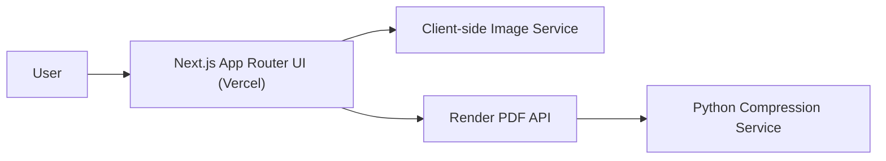

# Serverless Media Resizer Architecture

## Summary

The project is now a **split deployment with clean responsibilities**:

- a **Next.js frontend** for the UI, intended for Vercel
- a **browser-native image conversion pipeline**
- a **Python PDF compression backend**, intended for Render

This split is deliberate because the stronger PDF compression path depends on Python libraries and native processing that do not fit as well inside a plain Vercel function setup.

## Topology

## Runtime Paths

### Frontend

Core files:

- `app/layout.js`
- `app/page.js`
- `components/app-shell.js`
- `components/hero.js`

The React UI is a single-page workspace with two focused tools:

- **Image Studio**
- **PDF Lab**

The layout uses one polished shell rather than separate disconnected pages.

### Image workflow

Core files:

- `components/image-converter.js`
- `components/dropzone.js`
- `lib/image-service.js`

Flow:

1. User selects or drops an image.
2. The browser reads the file with `FileReader`.
3. Dimensions are resolved client-side.
4. Resize and reduction happen in a `canvas`.
5. The result is downloaded immediately from the browser.

This preserves the original strength of the old project:

- no upload round-trip
- strong privacy story
- fast feedback loop

### PDF workflow

Core files:

- `components/pdf-compressor.js`
- `server/app.py`
- `server/pdf_compress.py`

Flow:

1. User selects a PDF and a compression mode.
2. The browser posts the file to the URL configured by `NEXT_PUBLIC_PDF_API_URL`.
3. The Render backend stores the upload temporarily.
4. The Python service runs normalization and, when needed, raster compression passes with PyMuPDF and Pillow.
5. The compressed file is streamed back as a download.

The new PDF service targets the closest result under the selected size cap.

## Design Principles

### 1. Split by runtime strengths

Frontend and PDF service are separate because they have different hosting needs.

### 2. Keep image handling local

The image converter was already the strongest part of the product, so it stays entirely browser-side.

### 3. Make PDF behavior explicit

The PDF path now has a single external service contract instead of hidden in-app behavior.

### 4. Delete aggressively

The rebuild removes:

- Vue/Vite app code
- Flask backend code
- Ghostscript browser assets
- duplicate scaffold files
- stale routing and enum layers

## Current Tradeoffs

### Strengths

- much cleaner codebase structure
- clearer frontend/service boundary
- stronger UI and product presentation
- image workflow remains fast and reliable
- PDF compression now runs on a runtime better suited to it

### Limits

- the new PDF service is intentionally simple and safe
- `pdf-lib` can normalize and rewrite PDFs, but it is not a full native PDF optimization engine
- if you later want heavy PDF shrinking for scanned/image-dense files, you will still want a deeper compression engine behind the same route contract

## Suggested Evolution

### Near term

- add PDF fixtures and regression tests
- show compression delta in the UI before download
- add file size / page count validation

### Later

- detect scanned versus text/vector PDFs
- plug in a more advanced PDF backend behind `/api/pdf/compress` if needed
- preserve the current route contract so the UI does not need another rewrite

## Bottom Line

The architecture is now much healthier:

- **frontend stack:** greatly improved
- **repo clarity:** greatly improved
- **image path:** preserved and modernized
- **PDF path:** cleaner and easier to extend, though still open to deeper future optimization
