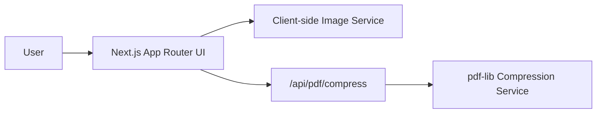

# Serverless Media Resizer Architecture

## Summary

The project is now a **single Next.js application** with:

- a glossy React frontend built in the App Router
- a browser-native image conversion pipeline
- a server-side PDF compression route handled inside Next.js

This rebuild intentionally removes the previous split architecture across Vue, Flask, and Ghostscript assets.

## Topology

## Runtime Paths

### Frontend

Core files:

- `app/layout.js`
- `app/page.js`
- `components/app-shell.js`
- `components/hero.js`

The React UI is a single-page workspace with two focused tools:

- **Image Studio**
- **PDF Lab**

The layout uses one polished shell rather than separate disconnected pages.

### Image workflow

Core files:

- `components/image-converter.js`
- `components/dropzone.js`
- `lib/image-service.js`

Flow:

1. User selects or drops an image.
2. The browser reads the file with `FileReader`.
3. Dimensions are resolved client-side.
4. Resize and reduction happen in a `canvas`.
5. The result is downloaded immediately from the browser.

This preserves the original strength of the old project:

- no upload round-trip
- strong privacy story
- fast feedback loop

### PDF workflow

Core files:

- `components/pdf-compressor.js`
- `app/api/pdf/compress/route.js`
- `lib/pdf-service.js`

Flow:

1. User selects a PDF and a compression mode.
2. The browser posts the file to `/api/pdf/compress`.
3. The route handler loads the PDF into a new service layer.
4. The service runs one or more normalization/compression passes with `pdf-lib`.
5. The compressed file is streamed back as a download.

The new PDF service exposes explicit modes:

- `preserve`
- `balanced`
- `maximum`

## Design Principles

### 1. One stack

Frontend and service logic live in one Next.js codebase. That reduces cognitive overhead and deployment complexity.

### 2. Keep image handling local

The image converter was already the strongest part of the product, so it stays entirely browser-side.

### 3. Make PDF behavior explicit

The PDF path now has a single route and a single implementation surface instead of split legacy pipelines.

### 4. Delete aggressively

The rebuild removes:

- Vue/Vite app code
- Flask backend code
- Ghostscript browser assets
- duplicate scaffold files
- stale routing and enum layers

## Current Tradeoffs

### Strengths

- much cleaner codebase structure
- one deployment model
- clearer frontend/service boundary
- stronger UI and product presentation
- image workflow remains fast and reliable

### Limits

- the new PDF service is intentionally simple and safe
- `pdf-lib` can normalize and rewrite PDFs, but it is not a full native PDF optimization engine
- if you later want heavy PDF shrinking for scanned/image-dense files, you will still want a deeper compression engine behind the same route contract

## Suggested Evolution

### Near term

- add PDF fixtures and regression tests
- show compression delta in the UI before download
- add file size / page count validation

### Later

- detect scanned versus text/vector PDFs
- plug in a more advanced PDF backend behind `/api/pdf/compress` if needed
- preserve the current route contract so the UI does not need another rewrite

## Bottom Line

The architecture is now much healthier:

- **frontend stack:** greatly improved
- **repo clarity:** greatly improved
- **image path:** preserved and modernized
- **PDF path:** cleaner and easier to extend, though still open to deeper future optimization
